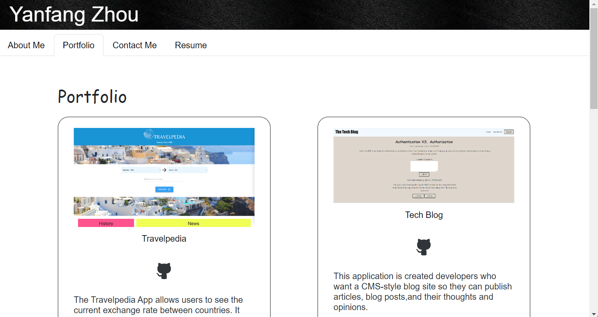

# text-editor

## Table of Contents
- [Description](#Description)
- [Technologies](#Technologies)
- [Usage](#Usage)
- [License](#License)
- [Deployment](##Deployment)
- [Contact](#Contact)
## Description
This react portfolio contains information about me, samples of my work and a contact form for any inquiries. Please note that the contact form is currently undergoing processing, and as such, kindly utilize the links provided in the contact section of this README to get in touch.

## Technologies
HTML  
CSS  
JavaScript  
Express  
Node  
React  
Visual Studio Code  
## Usage
When you load the portfolio, you will presented a page with a header, a section for content, and a footer. In the navigation, you will presented with the titles About Me, Portfolio, Contact me, and Resume, and the title corresponding to the current section is highlighted. When you load the portfolio the first time, the About Me title and section are selected by default.

When you presented with the About Me section, you will see a recent photo and a short bio about me.
When you presented with the Portfolio section, you will see titled images of six of the my applications with links to both the deployed applications and the corresponding GitHub repository.
When you presented with the Contact me section, you will see a contact form with fields for a name, an email address, and a message.
When you move your cursor out of one of the form fields without entering text, you will receive a notification that this field is required.
When you enter text into the email address field, you will receive a notification if I have entered an invalid email address.
When you am presented with the Resume section, you will see a link to a downloadable resume and a list of my proficiencies.
When you view the footer, you will presented with links to my GitHub and LinkedIn profiles, my profile on Stack Overflow.

The following image shows the web application's appearance and functionality:

## License
Application is covered under MIT https://opensource.org/licenses/MIT

## Deployment
Link to deployed application: https://zhou7cathy.github.io/my-react-portfolio/

## Contact
Link to my GitHub profile: https://github.com/zhou7cathy
Email me with any questions: zhou7cathy@gmail.com